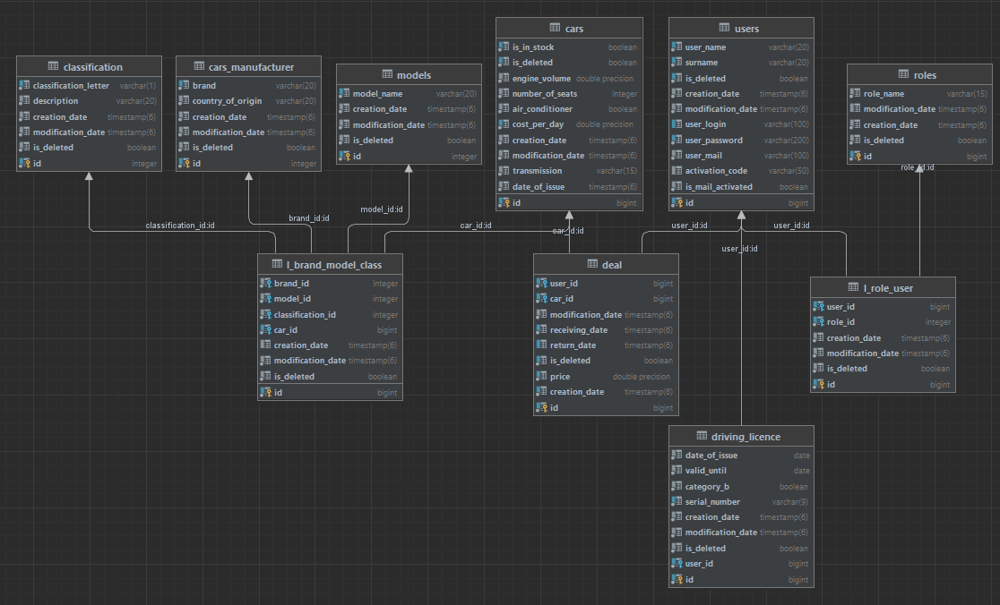

# CarsRentApp
___
#### This RestAPI is a service in a bundle database for your car rental business. Database:

### To work correctly, follow these steps:

#### 1) create the ***mail.properties*** file in the ***resources*** package (api module);

#### 2) fill it out as follows:  
- HOST=smtp.gmail.com   
- PORT=port  
- USER_NAME=gmail  
- PASSWORD=password   
- PROTOCOL=smtp/smtps
