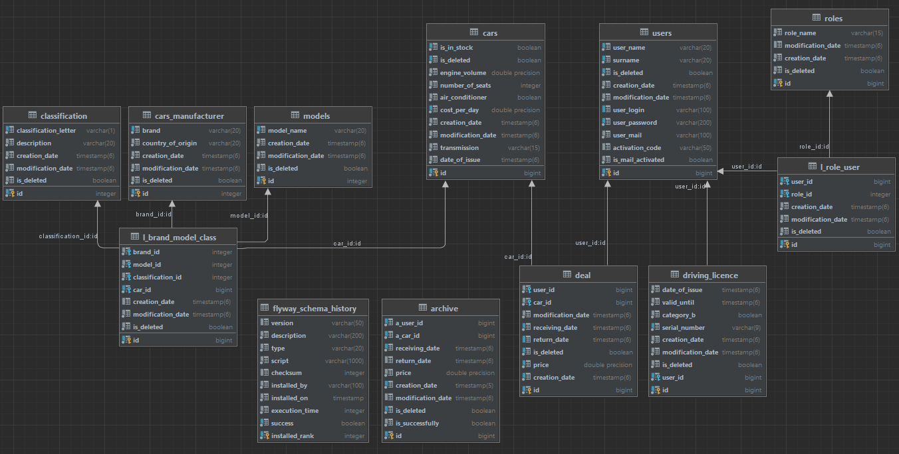

# CarsRentApp
___
#### This RestAPI is for your car rental business.  
Framework: **Spring**(Boot, Data, AOP, Cache, Security)

Dependencies: 
**Hibernate**, **Lombok** , **Flyway**, **Swagger**, **Cache Providers** (Caffeine, Eh-cache).

### DBMS: PostgreSQL. Database schema:

# Project functionality:

V1.0.0
- creating a user (with the ***anonymous*** role);
- confirming the mail (after that the user gets the ***user*** role);
- creating a driver's license;
- after that, you can create orders;
- the closing of the order is carried out by ***moderators*** or ***admin***;
- the creation of machines is also carried out by ***moderators*** or ***admin***.
### To work correctly, follow these steps:

#### 1) create the ***mail.properties*** file in the ***resources*** package (api module);

#### 2) fill it out as follows:  
- HOST=smtp.gmail.com   
- PORT=port  
- USER_NAME=gmail  
- PASSWORD=password   
- PROTOCOL=smtp/smtps
- YOUR_HOST=localhost:8080
